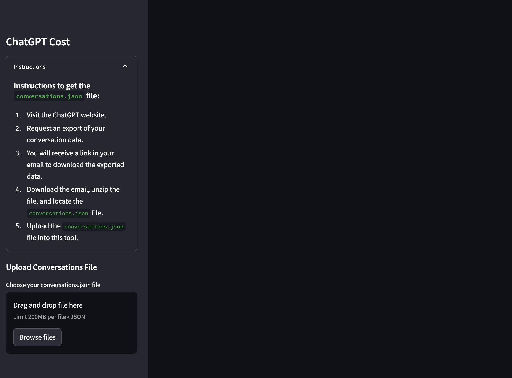
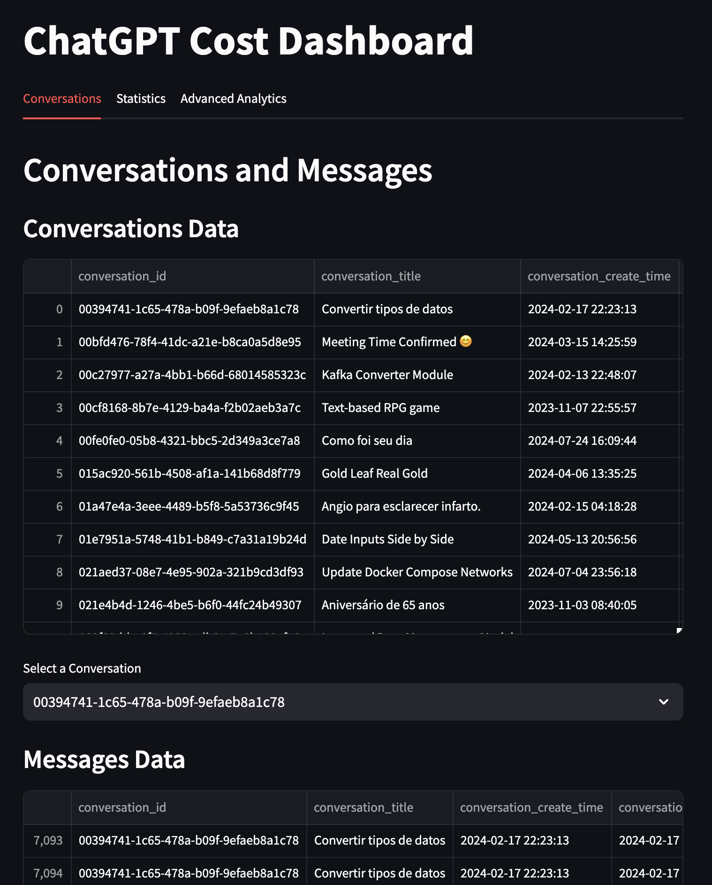
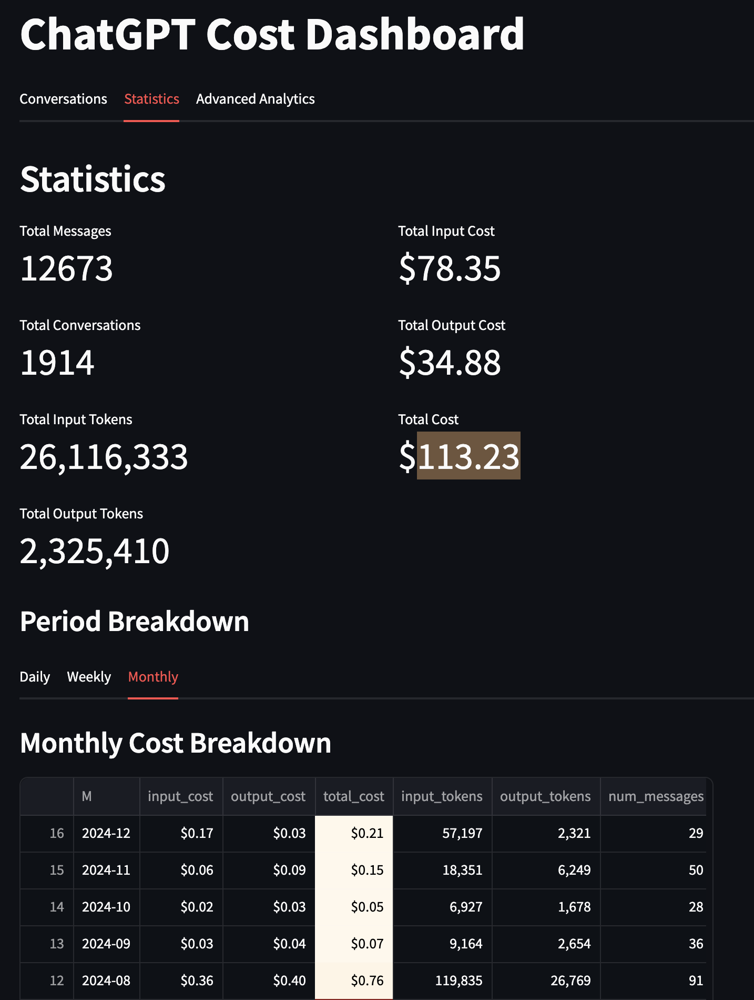

# ChatGPT Cost Dashboard

## Overview

The **ChatGPT Cost Dashboard** is a comprehensive tool designed to process, analyze, and visualize the costs associated with using OpenAI's ChatGPT if that were to be done by the API.  
This Streamlit application allows users to upload JSON files containing conversation data, which are then processed and stored in an SQLite database.  
The dashboard provides detailed insights into token usage, costs, and various analytical metrics, making it easier to manage and optimize the usage of ChatGPT.

You can find the application [here](https://chatgpt-cost-dashboard.streamlit.app/).
## Features

- **Data Upload and Processing**: Upload JSON files containing conversation data, which are processed and stored in an SQLite database.
- **Conversations Overview**: View detailed information about each conversation, including the number of messages, token usage, and costs.
- **Statistics and Metrics**: Get key metrics such as total messages, total conversations, input tokens, output tokens, and associated costs.
- **Period Breakdown**: Analyze costs over different periods (daily, weekly, monthly) with interactive charts.
- **Advanced Analytics**: Perform sentiment analysis, keyword frequency analysis, and cost forecasting.
- **Interactive Visualizations**: Use Plotly for advanced visualizations and Streamlit for an interactive user interface.

## Installation

1. **Clone the repository:**
   ```sh
   git clone https://github.com/madpin/chatgpt-cost-dashboard.git
   cd chatgpt-cost-dashboard
   ```

2. **Install the required dependencies:**
   ```sh
   pip install -r requirements.txt
   ```

3. **Run the application:**
   ```sh
   streamlit run app.py
   ```

## Usage

1. **Upload Conversations File**: Use the sidebar to upload your `conversations.json` file.
<!--  -->
     

2. **View Dashboard**: Once the file is processed, navigate through the tabs to explore different aspects of the conversation data.
   - **Conversations Tab**: View detailed conversation data and select specific conversations for more insights.
   <!--  -->
     
   
   - **Statistics Tab**: See summary statistics and breakdowns of costs over different periods.
   <!--  -->
   

   - **Advanced Analytics Tab**: (Future Implementation) Explore advanced analytics including sentiment and keyword analysis, and cost forecasting.

## File Structure

- **app.py**: The main application file containing all the logic and Streamlit code.
- **requirements.txt**: A list of all Python dependencies required for the project.
- **data/**: Directory to store the SQLite database.

## Key Functions

- **count_tokens(text: str) -> int**: Counts tokens in a given text using tiktoken.
- **safe_to_datetime(ts: float) -> str**: Safely converts a timestamp to a datetime string.
- **process_conversation(conversation: dict) -> list**: Processes a single conversation and returns a list of message dictionaries.
- **calculate_costs(df: pd.DataFrame) -> pd.DataFrame**: Calculates input, output, and total costs based on token usage.
- **process_json_to_sqlite(json_data, db_file)**: Processes JSON data and stores it in an SQLite database.
- **load_data(query)**: Loads data from the SQLite database based on a SQL query.
- **calculate_conversation_summary(df: pd.DataFrame) -> pd.DataFrame**: Calculates summary statistics for each conversation.
- **calculate_period_costs(df: pd.DataFrame, period: str) -> pd.DataFrame**: Calculates costs by specified periods (D, W, M).
- **sentiment_analysis(messages_df: pd.DataFrame) -> pd.DataFrame**: Performs basic sentiment analysis based on keywords.
- **keyword_analysis(messages_df: pd.DataFrame) -> pd.DataFrame**: Performs keyword frequency analysis.
- **cost_forecasting(df: pd.DataFrame) -> pd.DataFrame**: Forecasts future costs using linear regression.

## Future Work

- **Sentiment Analysis**: Implement a more sophisticated sentiment analysis using NLP models.
- **Keyword Analysis**: Enhance keyword analysis with better text processing techniques.
- **Cost Forecasting**: Improve the forecasting model for more accurate predictions.
- **Interactive Visualizations**: Add more interactive and customizable visualizations.

## Contributing

Contributions are welcome! Please fork the repository and create a pull request with your changes. Ensure that your code adheres to the project's coding standards and includes appropriate tests.

## License

This project is licensed under the MIT License. See the [LICENSE](LICENSE) file for details.

## Acknowledgements

Special thanks to the OpenAI team for developing such an amazing tool and to the Streamlit community for their continuous support and improvements to the platform.

---

Feel free to reach out with any questions or feedback. Happy analyzing!

---

**Author**: Thiago MadPin
**Contact**: [madpin@gmail.com]  